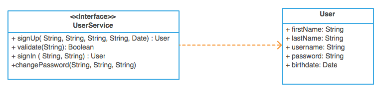
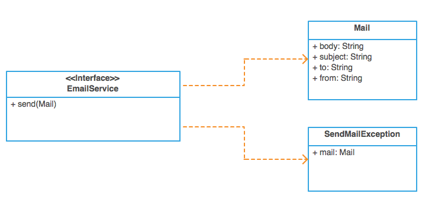

## Entrega 1 - JDBC

La primera entrega tiene como objetivo implementar el registro de usuarios y el login de los mismos. 

El líder del equipo de frontend se reúne con nosotros y nos muestra una interfaz:

Nos comenta que su equipo ya se encuentra bastante adelantado, llevan trabajando semanas contra una implementación mock de dicha interfaz y ya tienen la ui casi lista, pero es hora de hacer una implementación verdadera para dicho servicio. Obviamente no podemos modificar la interfaz `UserService` porque eso causaría incompatibilidades entre ambos equipos.

La interfaz `UserService` declara los siguientes métodos que nosotros debemos implementar:

- `User signUp((String firstName, String lastName, String username, String email, Date birthdate)` - este método crea un usuario nuevo en el sistema. Tener en cuenta que el username y el email deben ser únicos. Además, despúes de la registración del usuario, se debe enviar un mail al usuario para validar su cuenta. Para ello debe generarse un código de validación que se incluye en el mail.  

- `Boolean validate(String code)` - este método valida al usuario de ese código.  En caso de no encontrar ningún usuario asociado a ese código, se espera que arroje la excepción InvalidValidationCode (no chequeada). 

- `User signIn(String username, String password)` - este método valida que las credenciales del usuario sean correctas para poder ingresar al sitio. En caso de que sean incorrectas, arrojar la excepción IncorrectUsernameOrPassword.

- `void changePassword(String username, String oldPassword, String newPassword)` - este método deberá cambiar la contraseña del usuario. Se debe validar que la nueva contraseña no sea igual a la anterior.

Para el envió de mails tenemos el siguiente servicio escrito por otro grupo de trabajo:

La interfaz `EmailService` entiende un solo mensaje:

- `void send(Mail mail)` - no es necesario que implementen un envio real de mails, con hacer un mock del servicio alcanza. 

### Se pide:
- Que provean implementaciones para las interfaces descriptas anteriormente, haciendo uso de todo lo visto en clase.
- Asignen propiamente las responsabilidades a todos los objetos intervinientes, discriminando entre servicios, DAOs y objetos de negocio.
- Creen test unitarios para cada unidad de código entregada que prueben todas las funcionalidades pedidas, con casos favorables y desfavorables.
- Provean un archivo .sql con las sentencias DDL que sean necesarias para crear el schema de la base de datos (create tables).

### Recuerden que:
- No pueden modificar las interfaces `UserService` y `EmailService`, solo implementarlas.
- Pueden agregar nuevos métodos y atributos a las clases `User` y `Mail`.
